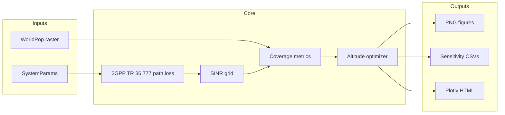

<div align="center">

# Population-Weighted Altitude Optimization for Sub-6 and mmWave UAV-BS Coverage in Coastal Bangladesh: A Dual-Threshold Sensitivity Study

**Cox's Bazar AOI · 3GPP TR 36.777 aerial UMa · WorldPop-weighted coverage**

**Author: Ranesh Das Rik**

[](https://www.python.org/)
[](https://www.3gpp.org/)
[](LICENSE)
[](tests/)

[Quick start](#quick-start) · [Results](#key-results) · [Reproduce](#full-reproduction) · [Citation](#citation)

</div>

---

## Overview

This repository provides a **reproducible research pipeline** that finds the optimal UAV altitude \(h^\*\) for population-weighted **5G downlink coverage** over **Cox's Bazar, Bangladesh**. The simulator implements the **3GPP TR 36.777** aerial Urban Macro (UMa) path-loss model, compares **Sub-6 GHz (3.5 GHz)** and **mmWave (28 GHz)**, and weights every grid point using **WorldPop 2025A** constrained population counts (2026 projection, clipped AOI).

The study separates **control** (PDCCH, \(\gamma_{\mathrm{th}} = 0\) dB) and **data** (PDSCH, \(\gamma_{\mathrm{th,data}} = 3\) dB) coverage, applies an **altitude-driven interference** model, and caps flight altitude with a simplified **battery / endurance** constraint (\(h_{\max} = 300\) m).

> **Regulatory note:** CAAB rules currently restrict routine BVLOS UAV operations in Bangladesh. Results are framed as **physical upper bounds** for disaster-response planning, tethered aerostat concepts, or future emergency authorizations—not operational flight plans.

---

## Key results

*WorldPop weights · \(P_{\mathrm{tx}} = 27\) dBm · 40×40 grid · ±5 km extent · endurance-capped sweep*

| Band | Optimal \(h^\*\) | Control coverage | Data coverage | Mean SINR @ \(h^\*\) |
|------|------------------:|-----------------:|--------------:|--------------------:|
| **Sub-6 (3.5 GHz)** | **221.3 m** | 73.37% | 55.28% | 5.07 dB |
| **mmWave (28 GHz)** | **120.2 m** | 4.35% | 3.14% | −12.60 dB |

**Δ\(h^\*\)** (mmWave − Sub-6) = **−101.1 m**

---

## Pipeline architecture



---

## Quick start

```bash
git clone https://github.com/rik-byte-shifter/coxsbazar-uav-5g-altitude-optimizer.git
cd coxsbazar-uav-5g-altitude-optimizer

python -m venv .venv
# Windows:  .venv\Scripts\activate
# Linux/macOS:  source .venv/bin/activate

pip install -r requirements.txt
python check_worldpop.py
python main.py
```

Open **`outputs/live_full_project.html`** in a browser for the interactive 9-phase simulation.

---

## Full reproduction

### 1. Install dependencies

Pinned versions in [`requirements.txt`](requirements.txt):

```bash
pip install -r requirements.txt
```

### 2. Population data

A **clipped Cox's Bazar raster** (~32 KB) is included at [`data/worldpop_coxsbazar.tif`](data/worldpop_coxsbazar.tif) so the pipeline runs without downloading the full country file.

To rebuild from the national product:

1. Download [WorldPop Bangladesh constrained count 100 m](https://www.worldpop.org/) (e.g. `bgd_pop_2026_CN_100m_R2025A_v1.tif`).
2. Place it in the project root.
3. Run:

```bash
python scripts/clip_worldpop.py
python check_worldpop.py
```

See [`data/README.md`](data/README.md) for GDAL/QGIS alternatives.

### 3. Run the pipeline

```bash
python main.py
```

This generates:

| Output | Description |
|--------|-------------|
| `outputs/fig1_sinr_surface_3d.png` | 3D SINR surface + \(h^\*\) ridge |
| `outputs/fig2_coverage_vs_altitude.png` | Control, data, and soft coverage vs \(h\) |
| `outputs/fig3_frequency_comparison.png` | Sub-6 vs mmWave |
| `outputs/bonus_population_sinr_maps.png` | WorldPop weights + SINR map |
| `outputs/fig4_sensitivity_hstar.png` | Control-channel sensitivity |
| `outputs/fig5_sensitivity_data_hstar.png` | Data-channel sensitivity |
| `outputs/sensitivity_results.csv` | Control sweep table |
| `outputs/sensitivity_data_results.csv` | Data sweep table |
| `outputs/live_*.html` | Interactive Plotly visualizations |
| `outputs/results_summary.txt` | Text summary |

### 4. Tests

```bash
python -m pytest tests/ -v
```

---

## Project structure

```
coxsbazar-uav-5g-altitude-optimizer/
├── uav_optimizer.py      # 3GPP path loss, SINR, coverage, optimizer
├── population_data.py    # WorldPop loader + synthetic fallback
├── main.py               # Full pipeline entry point
├── visualizations.py     # Publication figures (Fig 1–5)
├── sensitivity.py        # Control + data threshold sweeps
├── live_viz.py           # Plotly HTML animations
├── check_worldpop.py     # Raster verification
├── scripts/
│   └── clip_worldpop.py  # Clip national WorldPop → Cox's Bazar AOI
├── tests/
│   └── test_optimizer.py
├── data/
│   ├── worldpop_coxsbazar.tif   # Bundled clipped raster
│   └── README.md
├── requirements.txt
└── LICENSE
```

---

## Model highlights

| Component | Implementation |
|-----------|----------------|
| Path loss | 3GPP TR 36.777 / 38.901 UMa aerial, vectorized LoS/NLoS |
| Interference | Altitude-driven floor + neighbor-cell margin (not distance to serving UAV) |
| Coverage | Population-weighted binary, soft (sigmoid), control vs data thresholds |
| Optimization | `scipy.optimize.minimize_scalar` on soft coverage with sweep validation |
| Endurance | `max_endurance_altitude()` caps \(h_{\max}\) at 300 m (500 Wh, 120 W hover) |

Tune defaults in `SystemParams` inside [`uav_optimizer.py`](uav_optimizer.py).

---

## Citation

If you use this code in academic work, please cite the repository:

```bibtex
@software{coxsbazar_uav_5g_2026,
  author       = {Ranesh Das Rik},
  title        = {Population-Weighted Altitude Optimization for Sub-6 and mmWave UAV-BS Coverage in Coastal Bangladesh: A Dual-Threshold Sensitivity Study},
  year         = {2026},
  publisher    = {GitHub},
  url          = {https://github.com/rik-byte-shifter/coxsbazar-uav-5g-altitude-optimizer}
}
```

**References:** 3GPP TR 36.777 V15.0.0; 3GPP TR 38.901; WorldPop constrained population counts (2025A release).

---

## License

Copyright © 2026 **Ranesh Das Rik**. Released under the [MIT License](LICENSE).

---

<div align="center">

**Cox's Bazar, Bangladesh** · Dual-threshold Sub-6 / mmWave UAV-BS study · 3GPP aerial UMa

**Ranesh Das Rik**

</div>
